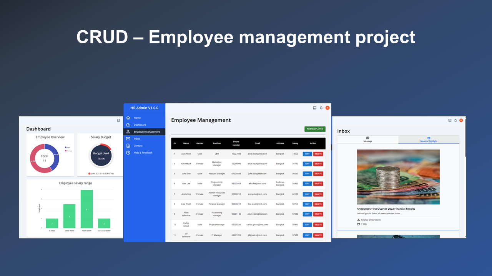
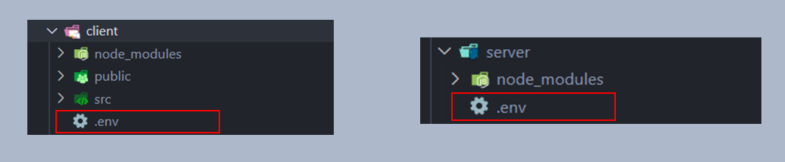

# CRUD Employee Management project


<br/>

[Live Site](https://ntp37-crud-hr-management-react.vercel.app)

## Introduction
The Full Stack project is a basic employee management with CRUD features

### System in Application
* CRUD for employee data
* Information Dashboard
* Table employee data

### Tools
* Local testing server by MAMP (MySQL Port `3306`)
* React
* Node.js
* Tailwind CSS
* Material UI
* React Tabs
* ApexCharts
* SweetAlert2
* Express.js
* Axios
* SWR
* MySQL2

### Getting Started
1. Run command `git clone <repository_link>`
2. Run command `cd client` and `cd server`
3. Install Node.js packages with command `npm install` in `client` and `server` folders
4. Create `.env` file in both folders



4. `.env` file in both folders insert following code

```
// .env in "client" folder
VITE_API = 'http://localhost:3000/'


// .env in "server" folder
DB_HOST = 'localhost'
DB_USER = 'root'
DB_PASSWORD = 'root7890'
DB_DATABASE = 'myemployee'
DB_PORT = 3306
```

5. Run command `npm run dev` in both folders
6. Open project with localhost your browser to see the result.
